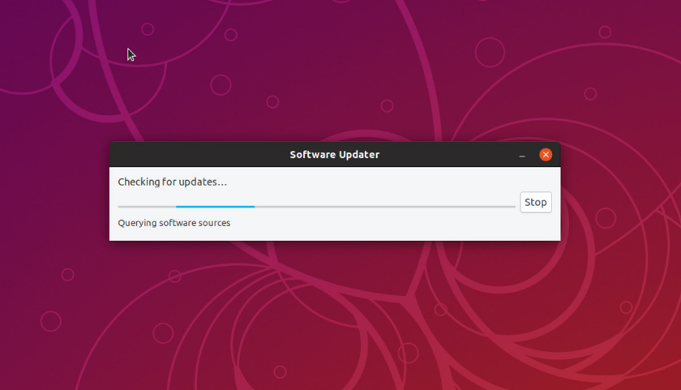
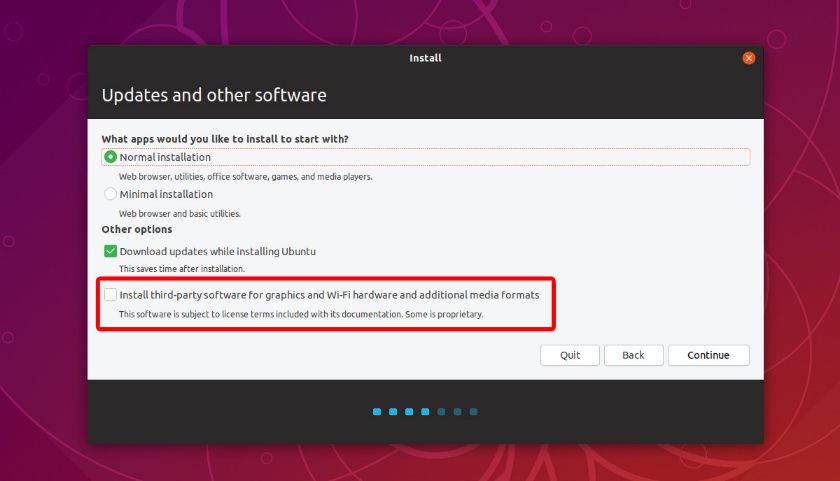
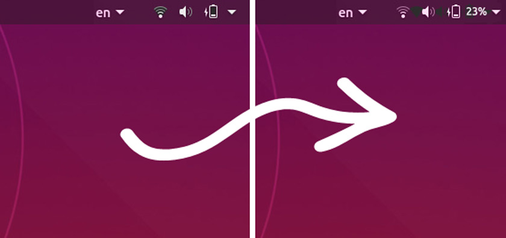

# UBUNTU-SETUP-101
Ok, let's go! Ce répo va me permettre de me rappeler de la configuration de mon Ubuntu :+1:

## Les choses à faire après avoir installé Ubuntu 18.10

- Mettre à jour le système


Yup bro ! Voici la commande pour installer les dernières mises à jours
```bash
sudo apt  update && sudo apt upgrade
```
- Installer les codecs vidéos



Si tu as oublié d'installer les codecs comme le montre la capture ci-dessous, pas de panique car vous pouvez les installer grâce à ce lien :arrow_right: [CODECS](apt://ubuntu-restricted-extras) :arrow_left:
- Afficher le niveau de la batterie



Ok bruh! Si tu veux afficher le niveau de la batterie (pourcentage), rien de plus simple. Il suffit juste de taper cette commande dans votre terminal :arrow_down:
```bash
gsettings set org.gnome.desktop.interface show-battery-percentage true
```

## Sublime Text 3 :heart:

__The best of the best of the best. I'm tellin' you man__
OK, tout d'abord il faut ajouter le paquet dans le 'dev channel apt' de Ubuntu
```bash
wget -qO - https://download.sublimetext.com/sublimehq-pub.gpg | sudo apt-key add -
sudo apt-get install apt-transport-https
echo "deb https://download.sublimetext.com/ apt/stable/" | sudo tee /etc/apt/sources.list.d/sublime-text.list
```
Maintenant que c'est fait, nous pouvons installer sublime text sur notre système
```bash
sudo apt-get update
sudo apt-get install sublime-text
```

### Les paquets à installer

Rappel : Si par hasard tu as oublié comment on fait (weird flex, but ok) ; les paquets sont à installer dans le Package Control de Sublime Text. 

Liste des paquets à installer :
- __BracketHighlighter__
- __DocBlockr__
- __GitGutter__

### Les paquets __difficiles__ à installer

Yup dans cette section je montre comment installer ces paquets qui peuvent vraiment faire mal à la tête aux premiers abords.

- __Markdown Preview__

Pour créer un raccourci-clavier afin de visualiser l'apercu Markdown, rien de plus simple
Preferences -> Key Bindings
```json
{ "keys": ["alt+m"], "command": "markdown_preview", "args": {"target": "browser", "parser":"github"} }
```
- __Predawn (Color Theme) & Material Theme(Theme)__

(voir la fin du fichier [setting_user.json](setting_user.json))

- __SublimeLinter__

Permet de vérifier si notre code n'a pas d'erreurs (NB : tu auras besoin d'installer nodejs & pear).  

| Nom du paquet | Description | Pré-requis |
|    :---       |   :---:     |   ---:     |
| SublimeLinter  | Paquet Mère | N/A |
| SublimeLinter-phpcs | Lint for php | ```sudo pear install PHP_CodeSniffer``` |
| SublimeLinter-jshint | Lint for JavaScript | ```sudo npm install -g jshint``` |

- __Anaconda :snake:__

Now we're talking bruh. Mais d'abord il faut installer python3.7 (si tu l'as pas dans ton système)  
```bash
sudo apt install python3.7
```
Maintenant on télécharge le script permettant d'installer _anaconda_. Voici le [lien](https://repo.anaconda.com/archive/Anaconda3-2018.12-Linux-x86_64.sh) de téléchargement. Après téléchargement, on exécute le script un mode user normal

```bash
bash ~/Downloads/Anaconda3-2018.12-Linux-x86_64.sh
```
Suivre les instructions du script pour la configuration.  
De retour dans Sublime Text 3, on installe le package ```Anaconda```. Dans les paramètres de votre projet coller le code ci-dessous
```json
{
    "build_systems":
    [
        {
            "file_regex": "^[ ]*File \"(...*?)\", line ([0-9]*)",
            "name": "Anaconda Python Builder",
            "selector": "source.python",
            "shell_cmd": "\"~/anaconda3/bin/python3.7\" -u \"$file\""
        }
    ],
    "folders":
    [
        {
            "path": "/home/ndoy3m4n/Documents/LEARNING_PYTHON"
        }
    ],
    "settings":
    {
        "anaconda_linting": true,
        "anaconda_linting_behaviour": "always",
        "pep257": false,
        "python_interpreter": "~/anaconda3/bin/python3.7",
        "use_pylint": false,
        "enable_docstrings_tooltip": true,
        "anaconda_tooltip_theme": "popup",
        "disable_anaconda_completion": false
    }
}
```

Voilà c'est terminé. Feel the power of the __ANACONDA__
